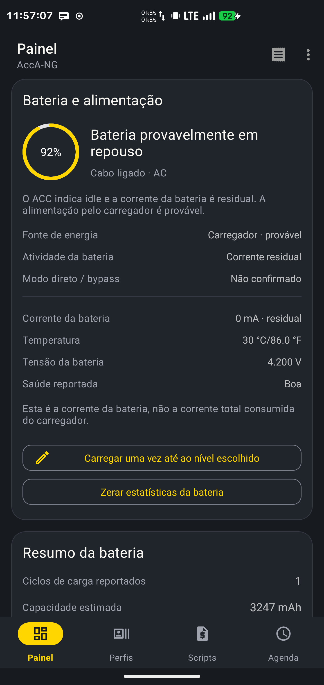
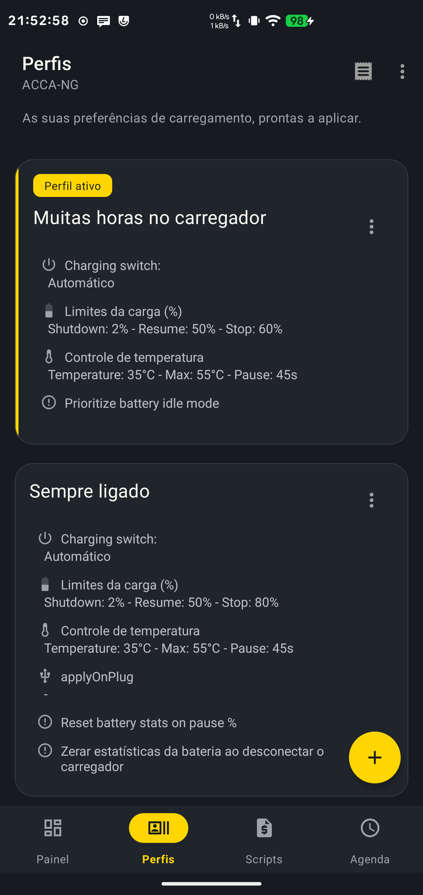

# AccA-NG


An independent, modernised fork of [AccA](https://github.com/MatteCarra/AccA)
for controlling charging on rooted Android devices. Maintained by
[Ricardo Pimentel](https://github.com/ricardojrgpimentel).

**Public beta · Android 8.0+ · Root required · Hardware/kernel dependent**

[Download signed APKs](https://github.com/ricardojrgpimentel/ACCA-NG/releases)
· [Report a problem](https://github.com/ricardojrgpimentel/ACCA-NG/issues)
· [Privacy](PRIVACY.md)
· [Build and release](docs/RELEASING.md)

## What it does

- Set charge pause/resume limits and save charging profiles.
- Configure current, voltage and temperature limits where the kernel supports them.
- Inspect battery readings, charging state and charging-control diagnostics.
- Calibrate current readings with the charger disconnected.
- Schedule charging settings through the bundled Daily Job Scheduler (DJS).
- Use light/dark themes and translated setup, charging and diagnostic screens in
  21 locales, with English fallback for older untranslated text.

The app bundles [ACC-NG](https://github.com/ricardojrgpimentel/ACC-NG)
**v1.0.4-ng candidate**, based on ACC v2023.10.16, and DJS **v2021.12.14**.
The engine controls charging in the background; limits come from your settings
and profiles. Disabling engine notifications does not disable charging protection.

<p>
  
  
</p>

## Install

1. Download the APK from this project's **GitHub Releases**. The fork is not yet
   published on F-Droid or Google Play; the original AccA listing is a different app.
2. Allow installation from your browser/file manager when Android asks, then install.
3. Open AccA-NG and grant root access through your root manager.
4. Read the ACC-NG setup explanation and confirm installation. The engine uses the
   Magisk module ID `acc`, so it replaces an existing ACC engine while preserving
   configuration and creating backups. Avoid controlling it from two frontends.
5. If current calibration is requested, disconnect all chargers and follow the
   diagnostics screen. Reconnect and verify charging actually pauses/resumes on
   your device before relying on a profile.

The release app ID is `com.accang.app`. Original AccA (`mattecarra.accapp`) and
local debug builds (`com.accang.app.debug`) install separately. Profiles do not
move automatically between these apps; use profile export/import where available.

Only the APK is needed to install. `SHA256SUMS` and the public signing certificate
are provided for verification. Future official GitHub APKs use the same signing
identity and an increasing `versionCode`; install them over the previous release.
See [signature verification](docs/RELEASING.md#verify-a-download).

## Beta scope and compatibility

Charging control depends on kernel control files, root access and BusyBox provided
by a compatible root setup. Android version alone does not establish compatibility.
ACC-NG retains ACC's controller loop, but neither the app nor the engine can
promise support for every device or guarantee battery health.

The recorded physical validation covers a **Samsung SM-G975F** and its kernel:
setup, calibration, profile application and observed charging pause/resume.
Boot persistence, other devices, a complete normal notification cycle and a
physical thermal-limit test remain unverified. See the
[validation record](docs/acc-ng-validation.md) for exact scope.

Review [ACC-NG documentation](https://github.com/ricardojrgpimentel/ACC-NG)
before changing charging controls. The GPL warranty disclaimer applies.

## Build

Requirements: JDK 17 or a compatible newer JDK, Android SDK platform 36 and Android
SDK Build Tools 34.0.0. The Gradle wrapper downloads Gradle 8.12; dependencies use
Google Maven, Maven Central and JitPack.

```sh
export ANDROID_HOME=/absolute/path/to/android-sdk
./gradlew :app:testDebugUnitTest :app:lintDebug :app:assembleDebug
```

Without release credentials, `./gradlew :app:assembleRelease` produces an unsigned
APK suitable for independent builds. Official signed releases use
[`tools/build-release.py`](tools/build-release.py). CI tests, lints and builds an
unsigned release without access to the private signing key.

## Development and licensing

The app uses AGP 8.7.3, Kotlin 2.0.21, Java 17 bytecode, Room/Moshi with KSP and
`compileSdk`/`targetSdk` 36 (`minSdk` 26). Root commands have bounded timeouts;
configuration reads report failures and profile writes are read back before
success is shown. Diagnostics are shared only when the user chooses to copy them.

AccA-NG is licensed under **GPL-3.0-or-later**. Original work is credited to
MatteCarra, Squabbi, VR25 and the upstream contributors; fork changes are maintained
by Ricardo Pimentel. See [LICENSE](LICENSE) and [third-party notices](THIRD_PARTY_NOTICES.md).

Pull requests and translations are welcome. Include app/engine versions, Android
version, device/kernel and reproduction steps in bug reports. Review logs before
posting them because they can contain device details, commands and profile names.

Translation sources are in `app/src/main/res/values/strings*.xml`; localized
resources use the corresponding `values-<language>-r<region>` directories.
`crowdin.yml` includes all these source files. Run
`python3 tools/check-translations.py` to check coverage of the new AccA-NG text,
duplicate keys, format arguments and line breaks. It reports inherited gaps
separately; empty legacy locale directories continue to use English. The expanded
translations include AI-assisted drafts and should receive native-speaker review.
